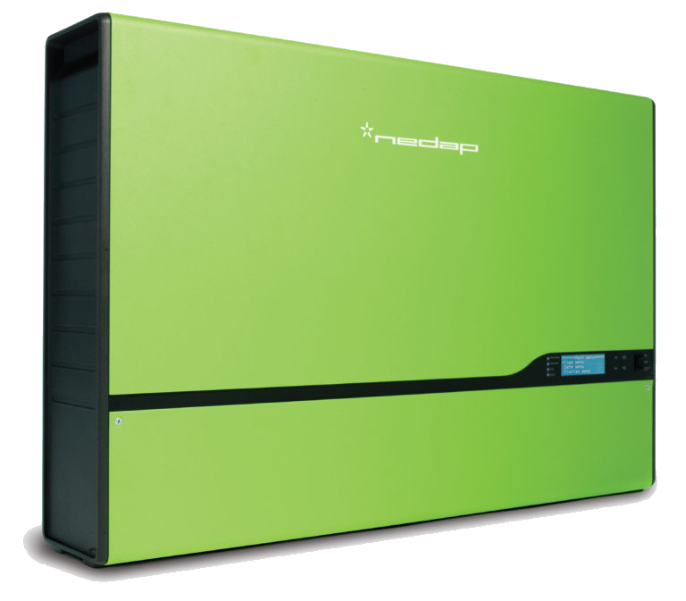
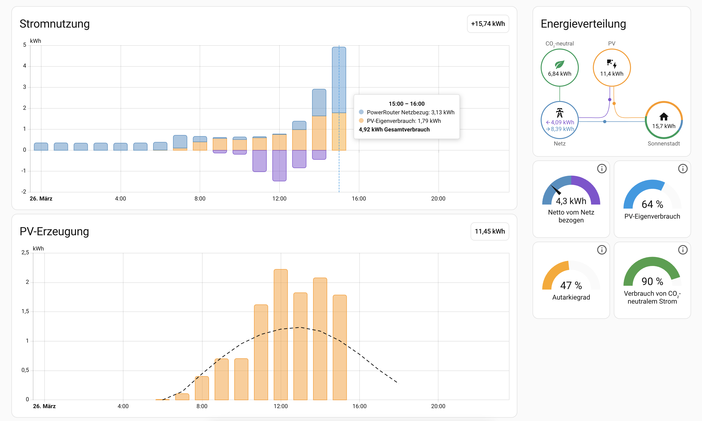
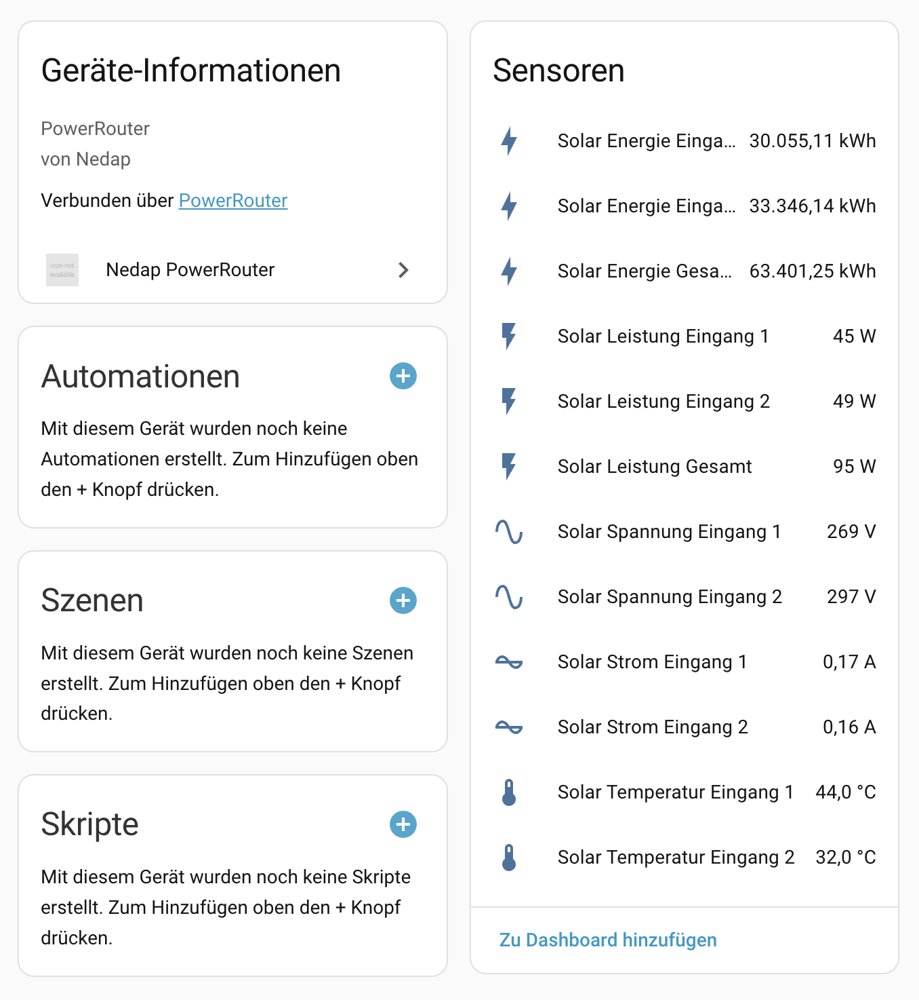

# Nedap PowerRouter – Home Assistant Integration

[](https://github.com/hacs/integration)
[](LICENSE)
[](https://www.home-assistant.io/)

<p align="center">
  
</p>

**[Deutsch](#deutsch)** | **[English](#english)**

---

> **Hintergrund / Background:** Die Cloud-Plattform mypowerrouter.com wird Ende 2026 eingestellt ([Ankündigung / Announcement](https://www.powerrouter.com/de/einstellung-mypowerrouter-com/)). Diese Integration ermöglicht es, die Daten des PowerRouters lokal in Home Assistant zu empfangen – unabhängig von der Cloud. / The cloud platform mypowerrouter.com will be shut down at the end of 2026. This integration allows you to receive PowerRouter data locally in Home Assistant – independent of the cloud.

---

# Deutsch

Custom Integration für Home Assistant, die die HTTP-POST-Daten des Nedap PowerRouters lokal abfängt und als Sensoren bereitstellt – inklusive Kompatibilität mit dem HA Energie-Dashboard.

<p align="center">
  
  <br><em>Energie-Dashboard mit Stromnutzung, PV-Erzeugung und Energieverteilung</em>
</p>

## Funktionsweise

Der PowerRouter sendet jede Minute einen HTTP-POST an `http://logging1.powerrouter.com/logs.json` (Port 80, unverschlüsselt). Durch eine DNS-Umleitung im lokalen Netzwerk wird dieser Traffic stattdessen an den Host weitergeleitet, auf dem Home Assistant läuft (oder an einen vorgeschalteten Reverse Proxy).

```
┌──────────────┐  HTTP POST /logs.json    ┌──────────────────────────────┐
│  PowerRouter │ ──────────────────────→  │  Ziel-Host                   │
│  (z.B.       │  (jede Minute, Port 80)  │  (z.B. 192.168.178.50)       │
│  192.168.    │                          │                              │
│  178.100)    │                          │  ┌────────────────────────┐  │
└──────────────┘                          │  │ Reverse Proxy (opt.)   │  │
       ↑                                  │  │ Port 80 → Port 8099    │  │
       │ DNS: logging1.powerrouter.com    │  └───────────┬────────────┘  │
       │       → 192.168.178.50           │              ↓               │
       │                                  │  ┌────────────────────────┐  │
┌──────────────┐                          │  │ Home Assistant         │  │
│  Router/DNS  │                          │  │ (Port 8099)            │  │
│  (FRITZ!Box, │                          │  │                        │  │
│   UniFi,     │                          │  │ nedap_powerrouter      │  │
│   Pi-hole)   │                          │  │ Integration            │  │
└──────────────┘                          │  │   → Sensoren für       │  │
                                          │  │     Energie-Dashboard  │  │
                                          │  └────────────────────────┘  │
                                          └──────────────────────────────┘
```

### Ablauf

1. Der PowerRouter sendet jede Minute einen HTTP-POST an `http://logging1.powerrouter.com/logs.json` (Port 80, unverschlüsselt).
2. Per **DNS-Override** in deinem Router wird `logging1.powerrouter.com` auf die IP des Ziel-Hosts umgeleitet – das ist die Maschine, die Port 80 entgegennimmt. In vielen Setups (z.B. Synology NAS mit HA in Docker) ist das derselbe Host. Falls HA auf einem separaten Gerät läuft (z.B. Raspberry Pi) und Port 80 dort frei ist, zeigt der DNS direkt auf die HA-IP.
3. Falls Port 80 auf dem Ziel-Host bereits belegt ist (z.B. durch DSM auf einer Synology), nimmt ein **Reverse Proxy** den Request auf Port 80 an und leitet ihn an Home Assistant auf Port 8099 weiter.
4. Die Integration empfängt den POST und stellt die Daten als Sensoren bereit.
5. **Optional:** Die Daten werden zusätzlich an den echten Nedap-Server weitergeleitet, damit das Portal weiterhin funktioniert (solange es verfügbar ist).

## Voraussetzungen

- **Home Assistant** ab Version 2024.1 (getestet mit 2026.3, Installationsmethode: Home Assistant Container)
- **Nedap PowerRouter** mit Netzwerkverbindung (z.B. PR50SBi-BS)
- **DNS-Umleitung** über Router, Pi-hole, AdGuard Home o.ä.
- **Reverse Proxy** (z.B. Synology DSM, nginx, Caddy) – nur nötig, wenn Port 80 auf dem Ziel-Host bereits belegt ist
- **Netzwerk**: PowerRouter muss den Ziel-Host auf Port 80 erreichen können

## Installation

### Methode 1: HACS (empfohlen)

1. Öffne HACS in Home Assistant
2. Klicke auf **"⋮" → Custom repositories**
3. Füge `https://github.com/sebastianeggersberger/ha-nedap-powerrouter` hinzu und wähle Kategorie **Integration**
4. Suche nach "**Nedap PowerRouter**" und installiere
5. Starte Home Assistant neu

### Methode 2: Manuell

Kopiere den Ordner `custom_components/nedap_powerrouter/` in dein Home Assistant Config-Verzeichnis:

```
<config>/
├── configuration.yaml
├── custom_components/
│   └── nedap_powerrouter/
│       ├── __init__.py
│       ├── config_flow.py
│       ├── const.py
│       ├── manifest.json
│       ├── sensor.py
│       ├── server.py
│       ├── strings.json
│       └── translations/
│           ├── de.json
│           └── en.json
```

**Home Assistant OS:** Nutze das Samba-Share- oder SSH-Add-on.
**Home Assistant Container (Docker):** Kopiere in dein gemountetes Config-Verzeichnis (z.B. `/volume1/docker/homeassistant/config/`).
**Home Assistant Core:** `cp -r custom_components/nedap_powerrouter/ ~/.homeassistant/custom_components/`

Anschließend Home Assistant neustarten.

## Konfiguration

### Schritt 1: DNS-Umleitung einrichten

Du musst `logging1.powerrouter.com` auf die IP des Ziel-Hosts umleiten – also auf die Maschine, die Port 80 entgegennimmt. In den Beispielen verwenden wir `192.168.178.50`. Ersetze diese IP durch die tatsächliche IP deines Setups.

> **Tipp:** Der Ziel-Host ist in der Regel die Maschine, auf der Home Assistant läuft. Falls HA in Docker auf einem Synology NAS läuft, ist es die NAS-IP. Falls HA auf einem eigenen Raspberry Pi läuft, ist es die Pi-IP.

Wähle die Methode, die zu deinem Setup passt:

#### FRITZ!Box

Die FRITZ!Box hat keine eingebaute DNS-Override-Funktion für einzelne Domains. Es gibt zwei Wege:

**Option A: Lokaler DNS-Server (empfohlen)**

Richte einen lokalen DNS-Server ein (Pi-hole oder AdGuard Home – siehe unten) und trage diesen in der FRITZ!Box als DNS-Server ein:

1. Öffne `http://fritz.box`
2. Gehe zu **Heimnetz → Netzwerk → Netzwerkeinstellungen → IPv4-Adressen**
3. Unter **Lokaler DNS-Server** die IP des Pi-hole/AdGuard eintragen
4. Stelle sicher, dass der PowerRouter seine DNS-Anfragen über die FRITZ!Box auflöst (Standard-Einstellung)

**Option B: DNS auf anderem Netzwerkgerät**

Falls du einen eigenen Router/Switch mit DNS-Funktionalität nutzt (z.B. OpenWrt, OPNsense), kannst du den DNS-Eintrag dort setzen.

#### UniFi (UCG, UDM, USG)

1. Öffne den UniFi Network Controller
2. Gehe zu **Settings → Networks** (oder **Settings → DNS**)
3. Unter **Static DNS entries** / **DNS Records**:
   - **Hostname**: `logging1.powerrouter.com`
   - **IP-Adresse**: `192.168.178.50` *(IP deines Ziel-Hosts)*
4. Speichern

Falls kein UI-Eintrag möglich ist, per SSH:
```bash
ssh root@<UniFi-IP>
echo "address=/logging1.powerrouter.com/192.168.178.50" >> /run/dnsmasq.conf.d/custom.conf
killall -HUP dnsmasq
```

> **Hinweis:** CLI-Änderungen können bei Firmware-Updates verloren gehen.

#### Pi-hole

1. Gehe zu **Local DNS → DNS Records**
2. Füge hinzu: `logging1.powerrouter.com` → `192.168.178.50`

#### AdGuard Home

1. Gehe zu **Filter → DNS-Umschreibungen**
2. Füge hinzu: `logging1.powerrouter.com` → `192.168.178.50`

#### Andere Router / dnsmasq

Die meisten Router mit dnsmasq-basiertem DNS unterstützen einen ähnlichen Eintrag:
```
address=/logging1.powerrouter.com/192.168.178.50
```

#### DNS testen

Von einem Gerät im selben Netzwerk wie der PowerRouter:
```bash
nslookup logging1.powerrouter.com
# Erwartete Antwort: 192.168.178.50
```

### Schritt 2: Port 80 → Home Assistant weiterleiten

Der PowerRouter sendet fest an Port 80. Je nach Setup gibt es verschiedene Wege, den Traffic an die Integration (Port 8099) weiterzuleiten.

#### Variante A: HA läuft direkt und Port 80 ist frei (z.B. Raspberry Pi)

Falls Home Assistant auf einem eigenen Gerät läuft und Port 80 nicht belegt ist:

1. DNS direkt auf die HA-IP zeigen lassen
2. Einen Reverse Proxy auf dem HA-Host einrichten (z.B. nginx, Caddy) oder die Integration auf Port 80 konfigurieren

```nginx
# nginx-Beispiel auf dem HA-Host
server {
    listen 80;
    server_name logging1.powerrouter.com;
    location /logs.json {
        proxy_pass http://127.0.0.1:8099;
    }
}
```

Bei **Home Assistant OS** ist Port 80 meist frei – hier kannst du z.B. das Add-on "Nginx Proxy Manager" nutzen.

#### Variante B: HA in Docker auf Synology NAS (Port 80 belegt durch DSM)

Da Port 80 auf der DiskStation vom DSM belegt ist, wird der DSM-eigene Reverse Proxy genutzt.

**Docker-Port-Mapping** in `docker-compose.yml` (oder im Container Manager):

```yaml
services:
  homeassistant:
    image: ghcr.io/home-assistant/home-assistant:stable
    ports:
      - "8123:8123"   # HA Web-UI
      - "8099:8099"   # PowerRouter-Daten
    volumes:
      - /volume1/docker/homeassistant/config:/config
    restart: unless-stopped
```

**Reverse Proxy im DSM konfigurieren:**

1. Öffne **DSM → Systemsteuerung → Anmeldeportal → Erweitert → Reverse Proxy**
2. Klicke **Erstellen**:

| Feld | Wert |
|------|------|
| **Beschreibung** | PowerRouter → Home Assistant |
| **Quelle – Protokoll** | HTTP |
| **Quelle – Hostname** | `logging1.powerrouter.com` |
| **Quelle – Port** | `80` |
| **Ziel – Protokoll** | HTTP |
| **Ziel – Hostname** | `localhost` |
| **Ziel – Port** | `8099` |

3. Speichern.

> **Erklärung:** Der DSM-nginx matcht den `Host`-Header `logging1.powerrouter.com` und leitet an `localhost:8099` weiter. Alle anderen Anfragen auf Port 80 gehen weiterhin an die DSM-Oberfläche.

#### Variante C: HA in Docker auf einem anderen Host (Port 80 frei)

Falls Home Assistant in Docker auf einem Linux-Server läuft und Port 80 frei ist, reicht ein zusätzliches Port-Mapping:

```yaml
ports:
  - "8123:8123"   # HA Web-UI
  - "80:8099"     # PowerRouter-Daten direkt auf Port 80
```

In diesem Fall wird kein separater Reverse Proxy benötigt.

### Schritt 3: Integration hinzufügen

1. Gehe zu **Settings → Devices & Services → + Add Integration**
2. Suche nach "**Nedap PowerRouter**"
3. Konfiguriere:
   - **Port**: `8099` (Standard – muss zum Docker-Mapping passen)
   - **Daten weiterleiten**: Optional – aktivieren, wenn die Daten auch an den echten Nedap-Server gehen sollen
   - **Echte Server-IP**: Die echte IP von `logging1.powerrouter.com` (ermitteln mit `dig @8.8.8.8 logging1.powerrouter.com +short`)
4. Bestätigen

### Schritt 4: Warten auf Daten

Nach der Konfiguration sendet der PowerRouter innerhalb von ca. 1 Minute seine ersten Daten.

## Sensoren

<p align="center">
  
  <br><em>Solar-Modul: Alle Sensoren mit Live-Daten</em>
</p>

### Energie-Dashboard

| Sensor | Entity ID | Verwendung |
|--------|-----------|------------|
| **Netzbezug** | `sensor.powerrouter_netzbezug` | Netzanschluss → Verbrauch |
| **Netzeinspeisung** | `sensor.powerrouter_netzeinspeisung` | Netzanschluss → Einspeisung |
| **Solar Energie Gesamt** | `sensor.powerrouter_solar_solar_energie_gesamt` | PV-Module |

### Alle Module

| Modul | Sensoren |
|-------|----------|
| **Platform (16)** | Frequenz, Netzspannung, Temperatur, Gesamtleistung, Energiezähler |
| **Wechselrichter (9)** | DC-AC Konverter: Frequenz, Spannung, Leistung, Energie, Temperatur |
| **Netz/EM24 (11)** | 3 Phasen (L1/L2/L3): Spannung, Strom, Leistung, Energie |
| **Solar (12)** | 2 Eingänge: Spannung, Strom, Leistung, Energie, Temperatur |
| **Batterie (136)** | Spannung, Strom, Leistung, Ladestand, Zyklen (falls vorhanden) |

### Energie-Dashboard konfigurieren

1. **Settings → Dashboards → Energy**
2. Netzanschluss:
   - Verbrauch: `sensor.powerrouter_netzbezug`
   - Einspeisung: `sensor.powerrouter_netzeinspeisung`
3. Solarmodule: `sensor.powerrouter_solar_solar_energie_gesamt`
4. Batterie (optional):
   - Geladen: `sensor.powerrouter_batterie_batterie_geladen`
   - Entladen: `sensor.powerrouter_batterie_batterie_entladen`

## Fehlerbehebung

**DNS prüfen:**
```bash
nslookup logging1.powerrouter.com
# Muss auf die IP deines Ziel-Hosts auflösen (z.B. 192.168.178.50)
```

**Reverse Proxy testen:**
```bash
curl -v -H "Host: logging1.powerrouter.com" http://192.168.178.50/logs.json
# Sollte HTTP 200 zurückgeben
```

**Port erreichbar?**
```bash
curl -v http://192.168.178.50:8099/logs.json
# Sollte direkt vom HA-Container antworten
```

**Debug-Logging aktivieren:**
```yaml
# In configuration.yaml:
logger:
  default: warning
  logs:
    custom_components.nedap_powerrouter: debug
```

**Sensoren zeigen "Unknown":** Normal – Sensoren werden erst aktualisiert, wenn der erste POST vom PowerRouter eintrifft (ca. 1–2 Minuten).

## Protokoll-Referenz

Der PowerRouter sendet jede Minute einen HTTP-POST mit folgendem JSON-Format:

```json
{
  "header": {
    "powerrouter_id": "SERIAL_NUMBER",
    "time_send": "2024-01-01T12:00:00+00:00",
    "version": 3,
    "period": 60
  },
  "module_statuses": [
    {
      "module_id": 16,
      "status": 18707,
      "param_0": 5002
    }
  ]
}
```

---

# English

Custom integration for Home Assistant that locally intercepts HTTP POST data from the Nedap PowerRouter and provides it as sensors – including compatibility with the HA Energy Dashboard.

<p align="center">
  
  <br><em>Energy Dashboard with power usage, solar production and energy distribution</em>
</p>

## How it works

The PowerRouter sends an HTTP POST every minute to `http://logging1.powerrouter.com/logs.json` (port 80, unencrypted). By overriding DNS in your local network, this traffic is redirected to the host where Home Assistant runs (or to an upstream reverse proxy).

```
┌──────────────┐  HTTP POST /logs.json    ┌──────────────────────────────┐
│  PowerRouter │ ──────────────────────→  │  Target Host                 │
│  (e.g.       │  (every minute, port 80) │  (e.g. 192.168.178.50)       │
│  192.168.    │                          │                              │
│  178.100)    │                          │  ┌────────────────────────┐  │
└──────────────┘                          │  │ Reverse Proxy (opt.)   │  │
       ↑                                  │  │ Port 80 → Port 8099   │  │
       │ DNS: logging1.powerrouter.com    │  └───────────┬────────────┘  │
       │       → 192.168.178.50           │              ↓               │
       │                                  │  ┌────────────────────────┐  │
┌──────────────┐                          │  │ Home Assistant         │  │
│  Router/DNS  │                          │  │ (Port 8099)            │  │
│  (FRITZ!Box, │                          │  │                        │  │
│   UniFi,     │                          │  │ nedap_powerrouter      │  │
│   Pi-hole)   │                          │  │ Integration            │  │
└──────────────┘                          │  │   → Sensors for        │  │
                                          │  │     Energy Dashboard   │  │
                                          │  └────────────────────────┘  │
                                          └──────────────────────────────┘
```

### Flow

1. The PowerRouter sends an HTTP POST every minute to `http://logging1.powerrouter.com/logs.json` (port 80, unencrypted).
2. A **DNS override** in your router redirects `logging1.powerrouter.com` to the IP of the target host – the machine that accepts traffic on port 80. In many setups (e.g. Synology NAS with HA in Docker), this is the same host. If HA runs on a separate device (e.g. Raspberry Pi) with port 80 free, DNS points directly to the HA IP.
3. If port 80 on the target host is already in use (e.g. by DSM on a Synology), a **reverse proxy** receives the request on port 80 and forwards it to Home Assistant on port 8099.
4. The integration receives the POST and provides the data as sensors.
5. **Optional:** Data is additionally forwarded to the real Nedap server so the portal continues to work (as long as it's available).

## Requirements

- **Home Assistant** version 2024.1+ (tested with 2026.3, installation method: Home Assistant Container)
- **Nedap PowerRouter** with network connectivity (e.g. PR50SBi-BS)
- **DNS redirection** via router, Pi-hole, AdGuard Home, etc.
- **Reverse proxy** (e.g. Synology DSM, nginx, Caddy) – only needed if port 80 is already in use on the target host
- **Network**: The PowerRouter must be able to reach the target host on port 80

## Installation

### Method 1: HACS (recommended)

1. Open HACS in Home Assistant
2. Click **"⋮" → Custom repositories**
3. Add `https://github.com/sebastianeggersberger/ha-nedap-powerrouter` and select category **Integration**
4. Search for "**Nedap PowerRouter**" and install
5. Restart Home Assistant

### Method 2: Manual

Copy the folder `custom_components/nedap_powerrouter/` into your Home Assistant config directory:

```
<config>/
├── configuration.yaml
├── custom_components/
│   └── nedap_powerrouter/
│       ├── __init__.py
│       ├── config_flow.py
│       ├── const.py
│       ├── manifest.json
│       ├── sensor.py
│       ├── server.py
│       ├── strings.json
│       └── translations/
│           ├── de.json
│           └── en.json
```

Then restart Home Assistant.

## Configuration

### Step 1: Set up DNS redirection

You need to redirect `logging1.powerrouter.com` to the IP of the target host – the machine that accepts traffic on port 80. In the examples we use `192.168.178.50`. Replace this IP with your actual setup IP.

> **Tip:** The target host is typically the machine running Home Assistant. If HA runs in Docker on a Synology NAS, it's the NAS IP. If HA runs on a dedicated Raspberry Pi, it's the Pi's IP.

Choose the method that fits your setup:

#### FRITZ!Box

The FRITZ!Box does not have a built-in DNS override feature for individual domains. There are two approaches:

**Option A: Local DNS server (recommended)**

Set up a local DNS server (Pi-hole or AdGuard Home – see below) and configure it in the FRITZ!Box:

1. Open `http://fritz.box`
2. Go to **Home Network → Network → Network Settings → IPv4 Addresses**
3. Set the **Local DNS server** to the IP of your Pi-hole/AdGuard
4. Ensure the PowerRouter resolves DNS queries via the FRITZ!Box (default setting)

**Option B: DNS on another network device**

If you have a separate router/switch with DNS capabilities (e.g. OpenWrt, OPNsense), you can set the DNS entry there.

#### UniFi (UCG, UDM, USG)

1. Open the UniFi Network Controller
2. Go to **Settings → Networks** (or **Settings → DNS**)
3. Under **Static DNS entries** / **DNS Records**:
   - **Hostname**: `logging1.powerrouter.com`
   - **IP address**: `192.168.178.50` *(your target host IP)*
4. Save

Via SSH (if no UI option):
```bash
ssh root@<UniFi-IP>
echo "address=/logging1.powerrouter.com/192.168.178.50" >> /run/dnsmasq.conf.d/custom.conf
killall -HUP dnsmasq
```

> **Note:** CLI changes may be lost after firmware updates.

#### Pi-hole

Go to **Local DNS → DNS Records** and add: `logging1.powerrouter.com` → `192.168.178.50`

#### AdGuard Home

Go to **Filters → DNS rewrites** and add: `logging1.powerrouter.com` → `192.168.178.50`

#### Other routers / dnsmasq

Most routers with dnsmasq support:
```
address=/logging1.powerrouter.com/192.168.178.50
```

#### Test DNS

```bash
nslookup logging1.powerrouter.com
# Expected: 192.168.178.50
```

### Step 2: Route port 80 to Home Assistant

The PowerRouter always sends to port 80. Depending on your setup, there are different ways to forward traffic to the integration (port 8099).

#### Option A: HA runs directly with port 80 free (e.g. Raspberry Pi)

If Home Assistant runs on a dedicated device and port 80 is not in use:

1. Point DNS directly to the HA IP
2. Set up a reverse proxy on the HA host (e.g. nginx, Caddy), or configure the integration to listen on port 80

```nginx
# nginx example on the HA host
server {
    listen 80;
    server_name logging1.powerrouter.com;
    location /logs.json {
        proxy_pass http://127.0.0.1:8099;
    }
}
```

With **Home Assistant OS**, port 80 is usually free – you can use the "Nginx Proxy Manager" add-on.

#### Option B: HA in Docker on Synology NAS (port 80 used by DSM)

Since port 80 is used by DSM, the built-in DSM reverse proxy is used.

**Docker port mapping** in `docker-compose.yml` (or Container Manager):

```yaml
services:
  homeassistant:
    image: ghcr.io/home-assistant/home-assistant:stable
    ports:
      - "8123:8123"   # HA Web UI
      - "8099:8099"   # PowerRouter data
    volumes:
      - /volume1/docker/homeassistant/config:/config
    restart: unless-stopped
```

**DSM Reverse Proxy:**

1. Open **DSM → Control Panel → Login Portal → Advanced → Reverse Proxy**
2. Click **Create**:

| Field | Value |
|-------|-------|
| **Description** | PowerRouter → Home Assistant |
| **Source – Protocol** | HTTP |
| **Source – Hostname** | `logging1.powerrouter.com` |
| **Source – Port** | `80` |
| **Destination – Protocol** | HTTP |
| **Destination – Hostname** | `localhost` |
| **Destination – Port** | `8099` |

3. Save.

> **How it works:** The DSM nginx matches the `Host` header `logging1.powerrouter.com` and forwards to `localhost:8099`. All other requests on port 80 continue to serve the DSM web interface.

#### Option C: HA in Docker on another host (port 80 free)

If Home Assistant runs in Docker on a Linux server and port 80 is free, a simple port mapping suffices:

```yaml
ports:
  - "8123:8123"   # HA Web UI
  - "80:8099"     # PowerRouter data directly on port 80
```

No separate reverse proxy needed in this case.

### Step 3: Add the integration

1. Go to **Settings → Devices & Services → + Add Integration**
2. Search for "**Nedap PowerRouter**"
3. Configure:
   - **Port**: `8099` (default – must match your Docker port mapping)
   - **Forward data**: Optional – enable to also send data to the real Nedap server
   - **Real server IP**: The actual IP of `logging1.powerrouter.com` (find with `dig @8.8.8.8 logging1.powerrouter.com +short`)
4. Confirm

### Step 4: Wait for data

After configuration, the PowerRouter will send its first data within approximately 1 minute.

## Sensors

<p align="center">
  
  <br><em>Solar module: All sensors with live data</em>
</p>

### Energy Dashboard

| Sensor | Entity ID | Usage |
|--------|-----------|-------|
| **Grid Import** | `sensor.powerrouter_netzbezug` | Grid → Consumption |
| **Grid Export** | `sensor.powerrouter_netzeinspeisung` | Grid → Return to grid |
| **Solar Energy Total** | `sensor.powerrouter_solar_solar_energie_gesamt` | Solar panels |

### All Modules

| Module | Sensors |
|--------|---------|
| **Platform (16)** | Frequency, grid voltage, temperature, total power, energy counters |
| **Inverter (9)** | DC-AC converter: frequency, voltage, power, energy, temperature |
| **Grid/EM24 (11)** | 3 phases (L1/L2/L3): voltage, current, power, energy |
| **Solar (12)** | 2 inputs: voltage, current, power, energy, temperature |
| **Battery (136)** | Voltage, current, power, state of charge, cycles (if present) |

### Energy Dashboard setup

1. **Settings → Dashboards → Energy**
2. Grid:
   - Consumption: `sensor.powerrouter_netzbezug`
   - Return to grid: `sensor.powerrouter_netzeinspeisung`
3. Solar: `sensor.powerrouter_solar_solar_energie_gesamt`
4. Battery (optional):
   - Charged: `sensor.powerrouter_batterie_batterie_geladen`
   - Discharged: `sensor.powerrouter_batterie_batterie_entladen`

## Troubleshooting

**Check DNS:**
```bash
nslookup logging1.powerrouter.com
# Must resolve to your target host IP (e.g. 192.168.178.50)
```

**Test reverse proxy:**
```bash
curl -v -H "Host: logging1.powerrouter.com" http://192.168.178.50/logs.json
# Should return HTTP 200
```

**Port reachable?**
```bash
curl -v http://192.168.178.50:8099/logs.json
# Should respond directly from HA
```

**Enable debug logging:**
```yaml
# In configuration.yaml:
logger:
  default: warning
  logs:
    custom_components.nedap_powerrouter: debug
```

**Sensors show "Unknown":** This is normal – sensors update when the first POST arrives from the PowerRouter (approx. 1–2 minutes).

---

## Disclaimer / Haftungsausschluss

> **DE:** Diese Custom Integration ist ein privates Hobby-Projekt und steht in keiner Verbindung zu Nedap N.V. Die Integration wurde mit Hilfe von [Claude](https://claude.ai) (Anthropic) erstellt und basiert auf den Erkenntnissen der folgenden Open-Source-Projekte und Communities:
>
> - [prpd von BenediktSeidl](https://github.com/BenediktSeidl/prpd) – PowerRouter Protocol Decoder
> - [powerinterface von ngrie](https://github.com/ngrie/powerinterface) – PowerRouter Web-Interface
> - [Photovoltaikforum Community](https://www.photovoltaikforum.com/thread/151868/) – Reverse-Engineering-Diskussionen
> - [Home Assistant Community](https://community.home-assistant.io/t/nedap-powerrouter-integration/541491) – Integration-Diskussionen
>
> Die Integration wird **ohne Gewährleistung** bereitgestellt. Nutzung auf eigene Gefahr. Erfolgreich getestet mit dem **Nedap PowerRouter PR50SBi-BS** (Firmware 8.0.10) und **Home Assistant 2026.3** (Home Assistant Container).
>
> **EN:** This custom integration is a private hobby project and is not affiliated with Nedap N.V. It was created with the help of [Claude](https://claude.ai) (Anthropic) and builds on the work of the open-source projects and communities listed above.
>
> The integration is provided **as-is, without warranty**. Use at your own risk. Successfully tested with the **Nedap PowerRouter PR50SBi-BS** (firmware 8.0.10) and **Home Assistant 2026.3** (Home Assistant Container).

## Lizenz / License

[MIT License](LICENSE)
